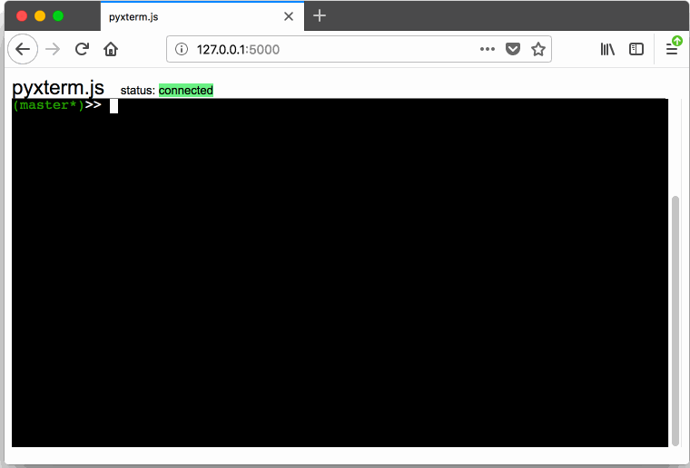

# LeoDock

An AI-powered development platform that combines terminal functionality with LLM collaboration capabilities.



## Features

- **Integrated Terminal**: Full-featured browser-based terminal using xterm.js
- **LLM Integration**: Built-in AI assistance and collaboration tools
- **Chat History**: Persistent conversation management with AI assistants
- **Multi-LLM Support**: Connect to various language models (Claude, local models, etc.)
- **Real-time Communication**: WebSocket-based real-time updates
- **Development Tools**: Auto-assist, monitoring, and debugging capabilities

## Architecture

### Backend
- **Flask** server with **Flask-SocketIO** for real-time communication
- **PTY** (pseudo-terminal) integration for terminal functionality
- **SQLite** database for chat history and session management
- **LLM Hub** for managing multiple AI model connections

### Frontend
- **Xterm.js** for terminal rendering in the browser
- **Real-time chat interface** for AI collaboration
- **Responsive design** with modern CSS

## Installation

### Clone & Run Locally

```bash
git clone https://github.com/greenantix/leodock
cd leodock
pip install -r requirements.txt
python run_leodock.py
```

### Using Nox (Recommended)

```bash
nox -s run
# or with debug mode
nox -s run -- --debug
```

## Usage

Start the LeoDock platform:

```bash
python run_leodock.py
```

The application will be available at `http://localhost:5000`

### Command Line Options

```bash
python run_leodock.py --help
```

## Configuration

LeoDock can be configured through:
- `config/settings.py` - Main application settings
- `config/lm_studio.py` - LM Studio integration
- `config/database.py` - Database configuration
- `leo_config.py` - Leo-specific configurations

## Development

The project structure:

```
leodock/
├── src/leodock/        # Main source code
│   ├── extensions/     # Core extensions and modules  
│   └── pyxtermjs/     # Terminal functionality
├── config/            # Configuration files
├── static/            # CSS and JavaScript files
├── templates/         # HTML templates
├── tests/             # Test files
├── docs/              # Documentation
├── scripts/           # Utility scripts
└── data/             # Database files
```

### Core Components

- `src/leodock/llm_hub.py` - Central LLM management
- `src/leodock/connection_manager.py` - WebSocket connection handling  
- `src/leodock/chat_history_manager.py` - Chat persistence
- `src/leodock/auto_assist.py` - AI auto-assistance features
- `src/leodock/pyxtermjs/` - Terminal functionality based on xterm.js
- `src/leodock/extensions/` - Modular extensions for LLM integration

## License

MIT License - see LICENSE file for details.